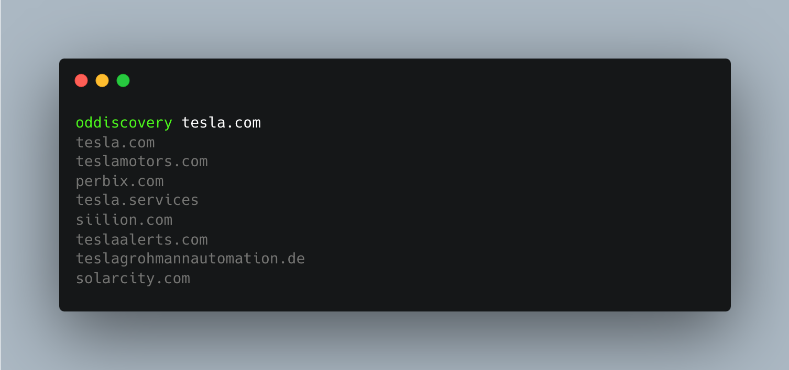

<h1 align="center">
  <image src="https://cdn2.iconfinder.com/data/icons/bloomies-files-and-documents/25/Bloomies_2_Onedrive_drive_cloud_microsoft_office_windows-1024.png" height=180px>
  <br>
</h1>

<h4 align="center"><i>oddiscovery</i> is a Python script designed to identify and list domains related to a given domain within the Office 365 environment.</h4>

## Features

- Fetch related domains for a specified Office 365 domain.
- Easy to use and configure.

## Requirements

- Python 3.x
- pipx

## Installation

1. pipx:

   ```sh
   pipx install git+https://github.com/phor3nsic/oddiscovery.git
   ```

## Usage

1. Open the script and configure the main domain you want to scan.

2. Run the script:

   ```sh
   oddiscovery example.com
   ```

3. The script will output a list of related domains.


## Example

Here is an example of how to use `oddiscovery`:



<br>
  <!--Tweet button-->
  <a href="https://twitter.com/intent/tweet?text=subdominex%20-%20Domain%20Asset%20Identification%20Tool%20https%3A%2F%2Fgithub.com%2Fphor3nsic%2Fsubdominex%20%23bash%20%23github%20%23linux%20%23infosec%20%23bugbounty" target="_blank">Share on Twitter!
  </a>
</p>

## Contributing

Feel free to fork this project, create a branch, and submit a pull request with your improvements.

## Buy Me A Coffee

If you have saved time or money using one of my tools and feel grateful for it, feel free to contribute so that I can dedicate more time to developing solutions.

<a href="https://www.buymeacoffee.com/phor3nsic" target="_blank"></a>

## License

This project is licensed under the MIT License.